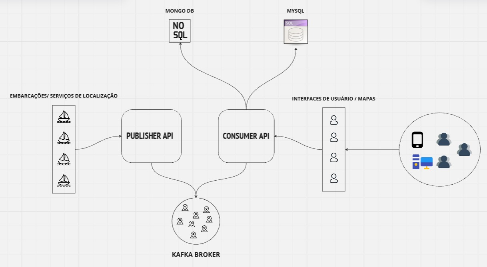

## Objetivo do projeto
Este projeto tem como objetivo desenvolver um sistema de persistência e transmissão de dados de localização em tempo real, garantindo a disponibilidade, escalabilidade e eficiência no armazenamento e na transmissão desses dados. A solução utiliza uma arquitetura baseada em microserviços, com Kafka como broker de mensagens para garantir a entrega confiável e o processamento distribuído dos dados de localização.

#### Arquitetura do sistema

